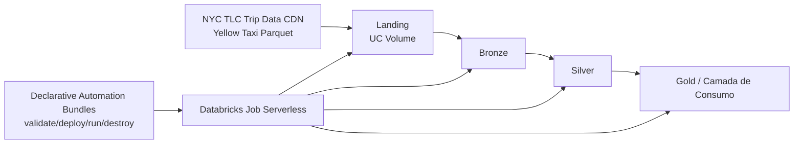

# NYC Taxi

Pipeline Lakehouse em Databricks para ingestao e processamento de dados de corridas de taxi, com arquitetura em camadas (`landing`, `bronze`, `silver`, `gold`).

## Arquitetura



## TL;DR

- Este repositorio implementa um pipeline de dados em Databricks para o dataset de Yellow Taxi.
- O pipeline é organizado em camadas (`landing`, `bronze`, `silver`, `gold`) e empacotado como wheel Python.
- A orquestração/deploy usa Declarative Automation Bundles (DAB) (`databricks bundle`) com execução em Serverless Jobs.
- O projeto inclui scripts DDL para bootstrap de catálogo, schemas e volumes no Unity Catalog.

## Status das camadas

- `landing`: implementada (download, idempotencia basica, metadados e modo discovery).
- `bronze`: implementada (Auto Loader -> Delta com checkpoint e schema evolution).
- `silver`: placeholder inicial.
- `gold`: placeholder inicial.

## Quickstart (Databricks Free Edition)

Pré-requisitos: Databricks CLI autenticado (`databricks auth login`) e `uv` instalado.

```bash
make uv-build
make dab-deploy ENV=dev CATALOG=nyc_taxi_dev
make dab-run ENV=dev WORKFLOW=nyc_taxi_job CATALOG=nyc_taxi_dev
```

Se precisar criar objetos do Unity Catalog antes do deploy, use:

- `docs/sql/001_create_catalog.sql`
- `docs/sql/002_create_schemas.sql`
- `docs/sql/003_create_volumes.sql`

Guia detalhado: `docs/FREE_EDITION_SETUP.md`.
Documentação oficial: [Databricks Declarative Automation Bundles](https://docs.databricks.com/en/dev-tools/bundles/).

## Execucao util (targets Makefile)

- Instalar dependencias locais: `make install`
- Rodar testes unitarios: `make test`
- Rodar testes da landing: `make test-landing`
- Rodar testes da bronze: `make test-bronze`
- Validar bundle: `make dab-validate ENV=dev CATALOG=nyc_taxi_dev`
- Deploy de bundle: `make dab-deploy ENV=dev CATALOG=nyc_taxi_dev`
- Executar workflow: `make dab-run ENV=dev WORKFLOW=nyc_taxi_job CATALOG=nyc_taxi_dev`

## Consultas analiticas de referencia (camada gold)

As consultas abaixo sao exemplos de consumo quando a camada `gold` estiver publicada.

**Pergunta A**: media de `total_amount` por mes.

```sql
SELECT
  date_trunc('month', tpep_pickup_datetime) AS month_ref,
  AVG(total_amount) AS avg_total_amount
FROM <catalog>.gold.<tabela_consumo>
GROUP BY 1
ORDER BY 1;
```

**Pergunta B**: media de `passenger_count` por hora do dia em um periodo.

```sql
SELECT
  hour(tpep_pickup_datetime) AS hour_of_day,
  AVG(passenger_count) AS avg_passenger_count
FROM <catalog>.gold.<tabela_consumo>
WHERE tpep_pickup_datetime >= TIMESTAMP('<inicio>')
  AND tpep_pickup_datetime < TIMESTAMP('<fim>')
GROUP BY 1
ORDER BY 1;
```

## Artefatos de Decisão e Governança

- **ADRs**: `docs/adr/README.md`
- **Threat Model**: `docs/threat-model.md`
- **TCO Model**: `docs/tco-model.md`
- **Analise por Camada (Landing/Bronze/Silver/Gold)**: `docs/layers/README.md`

## Estrutura do Repositório

Esta organizacao segue a estrutura base gerada pelo template `default-python` do Declarative Automation Bundles (DAB), com extensoes para um pipeline Lakehouse por camadas.

- `src/nyc_taxi/`: código fonte do pipeline
- `resources/`: definição de workflow/job com Declarative Automation Bundles (DAB)
- `tests/`: testes unitários
- `docs/adr/`: registros de decisões arquiteturais
- `docs/layers/`: analises tecnicas por camada do lakehouse
- `docs/sql/`: DDL de bootstrap

## Referências Técnicas

### Databricks (documentação oficial)

- [Databricks Declarative Automation Bundles (DAB)](https://docs.databricks.com/en/dev-tools/bundles/)
- [Databricks Jobs](https://docs.databricks.com/en/jobs/)
- [Serverless compute for workflows (Jobs)](https://docs.databricks.com/en/jobs/run-serverless-jobs.html)
- [Unity Catalog](https://docs.databricks.com/en/data-governance/unity-catalog/)
- [Unity Catalog Volumes](https://docs.databricks.com/en/volumes/)
- [PySpark on Databricks](https://docs.databricks.com/en/pyspark/)

### Leituras complementares

- [How to Structure Python Projects in 2026 Without Regretting It Later](https://medium.com/algomart/how-to-structure-python-projects-in-2026-without-regretting-it-later-dcf388a108c6)
- [Modern Python Code Quality Setup: uv, ruff, and mypy](https://simone-carolini.medium.com/modern-python-code-quality-setup-uv-ruff-and-mypy-8038c6549dcc)
- [How to structure your Data Engineering Projects?](https://medium.com/@jainvaibhav62/how-to-structure-your-data-engineering-projects-314fc4d50fa5)
- [A Modern Python Toolkit: Pydantic, Ruff, MyPy, and UV](https://dev.to/devasservice/a-modern-python-toolkit-pydantic-ruff-mypy-and-uv-4b2f)
- [Git project - dab-lakehouse-boilerplate](https://github.com/jojinmp/dab-lakehouse-boilerplate)
