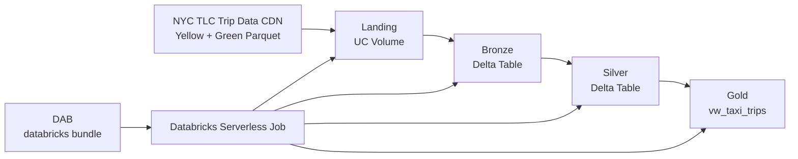

# NYC Taxi — Pipeline Lakehouse no Databricks

Pipeline de dados em camadas para ingestão e processamento do dataset **NYC TLC Trip Data** (Yellow e Green Taxi), implementado sobre Databricks com arquitetura Lakehouse.

---

## Índice

- [Overview](#overview)
- [Arquitetura](#arquitetura)
- [Setup](#setup)
- [Pontos de destaque](#pontos-de-destaque)
- [Possíveis melhorias](#possíveis-melhorias)
- [Referências](#referências)

---

## Overview

Este repositório implementa um pipeline de dados completo para o dataset público do [NYC Taxi & Limousine Commission (TLC)](https://www.nyc.gov/site/tlc/about/tlc-trip-record-data.page), cobrindo o fluxo de ponta a ponta: ingestão de arquivos Parquet externos, preservação do dado bruto, curadoria progressiva e publicação para consumo analítico.

A solução é inteiramente **automatizada e parametrizável** — o pipeline roda do zero com três comandos `make`, sem intervenção manual entre camadas. Apesar de utilizar Databricks como plataforma de execução, as decisões arquiteturais foram tomadas com foco em escalabilidade, auditabilidade e evolução incremental.

**Dataset**: NYC TLC Yellow Taxi e Green Taxi — arquivos Parquet mensais, distribuídos via CDN pública.

**Período coberto nos testes e análises**: janeiro a maio de 2023.

---

## Estrutura de Diretórios

```
nyc_taxi/
├── src/
│   └── nyc_taxi/
│       ├── core/
│       │   ├── config.py
│       │   └── logging_utils.py
│       └── lakehouse/
│           ├── landing/
│           │   └── main.py
│           ├── bronze/
│           │   └── main.py
│           ├── silver/
│           │   └── main.py
│           └── gold/
│               └── main.py
├── resources/
│   └── nyc_taxi_job.yml
├── tests/
│   ├── test_landing_main.py
│   ├── test_bronze_main.py
│   ├── test_silver_main.py
│   └── test_gold_main.py
├── docs/
│   ├── adr/
│   ├── layers/
│   ├── setup/
│   ├── sql/
│   ├── security/
│   └── cost/
├── analysis/
│   └── perguntas_analiticas.sql
├── databricks.yml
├── pyproject.toml
├── Makefile
└── README.md
```

### `src/nyc_taxi/`

Código-fonte do pipeline, empacotado como wheel Python (`nyc_taxi`). Segue o layout `src/` recomendado para projetos Python modernos, garantindo isolamento entre o código de produção e os artefatos de teste e build.

- **`core/config.py`** — definição centralizada do `PipelineConfig`: parâmetros de execução (catálogo, janela temporal, thresholds de DQ), FQNs das tabelas e caminhos de volume. É o contrato de configuração compartilhado entre todas as camadas.
- **`core/logging_utils.py`** — utilitários de logging estruturado usados por todas as camadas do pipeline.
- **`lakehouse/landing/main.py`** — lógica de download idempotente dos arquivos Parquet da CDN do TLC para o UC Volume, com suporte a modo explícito (lista de meses) e discovery (varredura de disponíveis).
- **`lakehouse/bronze/main.py`** — ingestão via Auto Loader do UC Volume para tabelas Delta, com checkpoint independente por tipo de táxi e preservação dos metadados de origem (`_source_file`, `_ingestion_ts`).
- **`lakehouse/silver/main.py`** — curadoria e normalização: DDL explícito, validação de DQ inline ancorada nos data dictionaries do TLC e MERGE idempotente para `yellow_taxi_trips` e `green_taxi_trips`.
- **`lakehouse/gold/main.py`** — criação da view de consumo `vw_taxi_trips`, unindo Yellow e Green com alias de colunas padronizado e contrato de schema para o consumidor analítico.

### `resources/`

Definições de workflow do Databricks em formato YAML, gerenciadas pelo DAB. O arquivo `nyc_taxi_job.yml` declara o job com suas tasks (uma por camada), parâmetros, permissões e configuração de compute Serverless — sem hardcode de `cluster_id` ou host.

### `tests/`

Testes unitários por camada, executáveis localmente sem SparkSession completo. Cada arquivo cobre os casos de transformação, validação de DQ e contratos de schema da respectiva camada.

### `docs/`

Documentação técnica organizada por tema:

- **`adr/`** — Architectural Decision Records: 15 ADRs documentando o *porquê* de cada decisão de design, com alternativas avaliadas e gatilhos para revisão. Ordem de leitura sugerida em [`docs/adr/README.md`](docs/adr/README.md).
- **`layers/`** — análise técnica de cada camada (Landing, Bronze, Silver, Gold): implementação atual, fluxo de execução, entradas/saídas, riscos e próximos passos.
- **`setup/`** — guia de setup para o Databricks Free Edition, cobrindo bootstrap do Unity Catalog, deploy do bundle e execução do workflow.
- **`sql/`** — scripts DDL de bootstrap: criação de catálogo, schemas e volumes no Unity Catalog, executados uma única vez antes do primeiro deploy.
- **`security/`** — threat model do pipeline: superfície de ataque, fluxos de dados sensíveis e controles implementados.
- **`cost/`** — modelo de monitoramento de custo: estimativas de TCO por camada e recomendações de otimização.

### `analysis/`

Consultas SQL ad-hoc sobre a camada Gold, respondendo às perguntas analíticas do case. Rodam diretamente no SQL Editor do Databricks contra a view `vw_taxi_trips`.

### Arquivos raiz

- **`databricks.yml`** — manifesto principal do DAB: define targets (`dev`, `prd`), variáveis parametrizáveis (`catalog`, `wheel_file`) e referências aos recursos em `resources/`.
- **`pyproject.toml`** — configuração do projeto Python: dependências, entrypoints do wheel (`ingest_landing`, `ingest_bronze`, `ingest_silver`, `ingest_gold`), ferramentas de qualidade (`ruff`, `mypy`) e configuração do `pytest`.
- **`Makefile`** — interface unificada de operações: build, testes, deploy e execução do pipeline via targets padronizados.

---

## Arquitetura

O pipeline adota a **arquitetura Lakehouse em camadas**, combinando a flexibilidade de um Data Lake (armazenamento de baixo custo, dado bruto histórico) com a confiabilidade semântica de um Data Warehouse (tabelas Delta com ACID, schema e SQL).



### Responsabilidade de cada camada

| Camada | Objetivo | Tecnologia |
|--------|----------|------------|
| **Landing** | Zona de aterrissagem — download idempotente dos arquivos Parquet da CDN do TLC, com isolamento por subpath e política de falha parcial por mês | UC Volume + Python HTTP |
| **Bronze** | Preservação fiel da fonte com rastreabilidade (`_source_file`, `_ingestion_ts`) — uma tabela Delta por tipo de táxi | Auto Loader + Delta (append-only) |
| **Silver** | Curadoria, normalização e contrato semântico — uma tabela Delta por tipo de táxi com DDL explícito, DQ inline e MERGE idempotente | PySpark + Delta MERGE |
| **Gold** | Publicação para consumo analítico — view única `vw_taxi_trips` unindo Yellow e Green com contrato de colunas padronizado | Delta View |

### Stack de infraestrutura

| Componente | Papel |
|------------|-------|
| Databricks Serverless Jobs | Compute de execução dos jobs — sem gerenciamento de cluster |
| Unity Catalog | Catálogo, controle de acesso, tags e volumes |
| Delta Lake | Formato de tabela com ACID, versionamento e schema enforcement |
| DAB (Declarative Automation Bundles) | CI/CD — build, deploy, run e destroy do pipeline como código |
| Python Wheel (`nyc_taxi`) | Empacotamento do código como artefato de produção |

### Decisões arquiteturais (ADRs)

As decisões de design estão documentadas em [`docs/adr/`](docs/adr/README.md). Algumas das mais relevantes:

- [ADR-001](docs/adr/ADR-001-escolha-arquitetura-lakehouse.md) — Escolha da arquitetura Lakehouse
- [ADR-003](docs/adr/ADR-003-serverless-vs-classic-cluster.md) — Serverless Jobs vs. Classic Cluster
- [ADR-009](docs/adr/ADR-009-bronze-estrategia-ingestao.md) — Auto Loader como estratégia de ingestão Bronze
- [ADR-013](docs/adr/ADR-013-silver-data-model-per-taxi.md) — Data model da Silver
- [ADR-014](docs/adr/ADR-014-gold-data-model-per-question.md) — Gold Data Model (view única de consumo)
- [ADR-015](docs/adr/ADR-015-governanca-qualidade-dados.md) — Governança e Qualidade de Dados

---

## Setup

### Pré-requisitos

- [Databricks CLI](https://docs.databricks.com/en/dev-tools/cli/install.html) instalado e autenticado (`databricks auth login`)
- [`uv`](https://docs.astral.sh/uv/) instalado
- Serverless Jobs habilitados no workspace Databricks

### Execução rápida

```bash
# 1. Build do wheel Python
make uv-build

# 2. Deploy do bundle (cria jobs e configura variáveis no workspace)
make dab-deploy ENV=dev CATALOG=nyc_taxi_dev

# 3. Execução do pipeline completo
make dab-run ENV=dev WORKFLOW=nyc_taxi_job CATALOG=nyc_taxi_dev
```

### Bootstrap do Unity Catalog (se necessário)

Execute os scripts DDL em ordem no Databricks SQL Editor:

```sql
-- 1. Criar catálogo
-- docs/sql/001_create_catalog.sql

-- 2. Criar schemas (landing, bronze, silver, gold)
-- docs/sql/002_create_schemas.sql

-- 3. Criar volumes na landing
-- docs/sql/003_create_volumes.sql
```

> Se o workspace não permitir criação de catálogo, pule o script `001` e use um catálogo existente nas variáveis.

### Targets Makefile disponíveis

| Comando | Descrição |
|---------|-----------|
| `make install` | Instala dependências locais |
| `make test` | Roda todos os testes unitários |
| `make test-landing` / `test-bronze` / `test-silver` / `test-gold` | Testes por camada |
| `make dab-validate ENV=dev CATALOG=...` | Valida o bundle sem fazer deploy |
| `make dab-deploy ENV=dev CATALOG=...` | Deploy do bundle no workspace |
| `make dab-run ENV=dev WORKFLOW=... CATALOG=...` | Executa o workflow |

Guia completo: [`docs/setup/FREE_EDITION_SETUP.md`](docs/setup/FREE_EDITION_SETUP.md).

### Consultas analíticas de referência

A Gold expõe a view `vw_taxi_trips` com colunas padronizadas (`VendorID`, `passenger_count`, `total_amount`, `tpep_pickup_datetime`, `tpep_dropoff_datetime`, `taxi_type`). Exemplos de queries em [`analysis/perguntas_analiticas.sql`](analysis/perguntas_analiticas.sql).

**Média mensal de `total_amount` (Yellow Taxi):**

```sql
SELECT
  date_trunc('month', tpep_pickup_datetime) AS month_ref,
  AVG(total_amount)                          AS avg_total_amount,
  COUNT(*)                                   AS trips_count
FROM <catalog>.gold.vw_taxi_trips
WHERE taxi_type = 'yellow'
GROUP BY 1
ORDER BY 1;
```

**Média de `passenger_count` por hora do dia em mai/2023 (Yellow + Green):**

```sql
SELECT
  hour(tpep_pickup_datetime) AS hour_of_day,
  AVG(passenger_count)       AS avg_passenger_count,
  COUNT(*)                   AS trips_count
FROM <catalog>.gold.vw_taxi_trips
WHERE tpep_pickup_datetime >= TIMESTAMP('2023-05-01')
  AND tpep_pickup_datetime <  TIMESTAMP('2023-06-01')
  AND passenger_count IS NOT NULL
GROUP BY 1
ORDER BY 1;
```

---

## Pontos de destaque

### Pipeline completamente idempotente

Todas as camadas foram projetadas para serem reexecutadas com segurança: a Landing verifica arquivos já presentes antes de baixar; a Bronze usa Auto Loader com checkpoint independente por tipo de táxi; a Silver usa MERGE com chave composta que impede duplicação lógica. Um reprocessamento não corrompe dados nem gera duplicatas.

### CI/CD como código com DAB

O deploy, parametrização e execução do pipeline são inteiramente gerenciados via [Declarative Automation Bundles](https://docs.databricks.com/en/dev-tools/bundles/) — sem hardcode de workspace host, user path ou `cluster_id`. O bundle é versionado no repositório e promovido por ambiente via variáveis (`catalog`, `wheel_file`).

### Qualidade de dados inline na Silver

As regras de DQ estão ancoradas nos [data dictionaries oficiais do TLC](https://www.nyc.gov/assets/tlc/downloads/pdf/data_dictionary_trip_records_yellow.pdf) e são testadas no CI via `test_enum_lists_match_data_dictionary`. Thresholds de volume e taxa de rejeição são configuráveis por `PipelineConfig` (`dq_max_rejection_rate`, `dq_min_rows_per_month`).

### Governança via Unity Catalog

Todas as tabelas Silver possuem Unity Catalog tags (`layer`, `domain`, `taxi_type`, `criticality`, `pii`). O schema é formalizado via DDL explícito (`CREATE TABLE IF NOT EXISTS` com `_SILVER_COLUMN_TYPES`) — contrato de consumo auditável via `DESCRIBE EXTENDED`.

### Empacotamento como Python Wheel

O código de produção é empacotado como wheel com `uv build` e distribuído como artefato versionado no job. Isso garante isolamento de dependências, reprodutibilidade entre ambientes e compatibilidade com o modelo de execução Serverless do Databricks.

### Genie Space para consultas em linguagem natural

A view `vw_taxi_trips` publicada na Gold é diretamente consumível pelo [Databricks Genie Space](https://docs.databricks.com/en/genie/index.html) — interface de BI conversacional nativa do Databricks. Com Genie, analistas e stakeholders podem responder perguntas sobre o dataset em linguagem natural ("qual o mês com maior receita média por corrida?", "quantas corridas foram feitas na última semana de maio?") sem escrever SQL ou depender de engenharia de dados para cada nova pergunta. O Genie traduz as perguntas para SQL automaticamente, executa contra a view já curada e retorna resultados com rastreabilidade da query gerada. O principal benefício desta abordagem é o desacoplamento entre a demanda analítica e o ciclo de desenvolvimento do pipeline: o contrato de colunas da Gold (`VendorID`, `passenger_count`, `total_amount`, `tpep_pickup_datetime`, `tpep_dropoff_datetime`, `taxi_type`) funciona como o vocabulário que o Genie usa para explorar os dados — tornando a camada Gold não apenas um artefato técnico, mas um produto de dados acessível ao negócio.

### ADRs como documentação de raciocínio

O projeto mantém 15 Architectural Decision Records documentando o *porquê* de cada escolha técnica — incluindo alternativas avaliadas, trade-offs aceitos e gatilhos para revisão. Ver [`docs/adr/`](docs/adr/README.md).

---

## Possíveis melhorias

As melhorias abaixo foram documentadas nas ADRs como próximos passos naturais, priorizados para quando o pipeline evoluir de MVP para produção:

### Qualidade e governança de dados

- **Databricks Labs DQX** — substituir o `where(_validation_expression(...))` atual por DQX para separar `valid_df` de `invalid_df` com rastreabilidade da regra de rejeição por registro e publicação de métricas estruturadas em tabela de observabilidade.
- **datacontract CLI** — formalizar o contrato de schema de cada camada em `datacontract.yaml` versionado no repositório, com validação automática no CI contra o Unity Catalog para detectar drift de schema sem intervenção humana.
- **Tabela de quarentena observável** — materializar registros rejeitados na Silver em `silver_quarantine_table_fqn_for(taxi_type)` (já previsto no `PipelineConfig`), eliminando o drop silencioso atual.

### Observabilidade

- **Métricas de DQ como tabela** — gravar métricas de qualidade por execução (taxa de rejeição, contagem de erros por regra e período) em `observability.dq_metrics` no Unity Catalog, permitindo alertas por threshold e dashboards de SLA.
- **Alertas de pipeline** — integrar notificações de falha e drift de volume ao sistema de alertas do Databricks Jobs.

### Infraestrutura e escalabilidade

- **Ingestão incremental na Landing** — implementar estratégia de janela temporal dinâmica baseada no watermark da Bronze, eliminando a necessidade de parametrizar datas manualmente.
- **Schema drift automático** — adicionar validação automática de que o schema entregue pela Bronze corresponde ao esperado pela Silver, detectando drift antes do MERGE.
- **Suporte a mais tipos de táxi** — o pipeline já suporta Yellow e Green; estender para FHV e HVFHV requereria apenas novos `PipelineConfig` e DDLs Silver sem redesign estrutural.

### Testes e qualidade de código

- **Testes de integração entre camadas** — adicionar testes de fronteira (Bronze → Silver, Silver → Gold) para detectar regressões de contrato sem necessidade de execução do pipeline completo.
- **Cobertura de testes da Gold** — a camada Gold possui cobertura de testes mínima; ampliar cobertura da lógica de alias `lpep_*` → `tpep_*` e do contrato de colunas da view.

---

## Referências

### Databricks (documentação oficial)

- [Databricks Declarative Automation Bundles (DAB)](https://docs.databricks.com/en/dev-tools/bundles/)
- [Databricks Jobs](https://docs.databricks.com/en/jobs/)
- [Serverless compute for workflows](https://docs.databricks.com/en/jobs/run-serverless-jobs.html)
- [Unity Catalog](https://docs.databricks.com/en/data-governance/unity-catalog/)
- [Unity Catalog Volumes](https://docs.databricks.com/en/volumes/)
- [Auto Loader](https://docs.databricks.com/en/ingestion/cloud-object-storage/auto-loader/index.html)
- [Delta Lake](https://docs.delta.io/latest/index.html)

### Dataset

- [NYC TLC Trip Record Data](https://www.nyc.gov/site/tlc/about/tlc-trip-record-data.page)
- [Yellow Taxi Data Dictionary](https://www.nyc.gov/assets/tlc/downloads/pdf/data_dictionary_trip_records_yellow.pdf)
- [Green Taxi Data Dictionary](https://www.nyc.gov/assets/tlc/downloads/pdf/data_dictionary_trip_records_green.pdf)

### Ferramentas e bibliotecas

- [Databricks Labs DQX](https://databrickslabs.github.io/dqx/) — framework de qualidade de dados para Databricks
- [datacontract CLI](https://datacontract.com/) — contratos de dados como código
- [uv — Python package manager](https://docs.astral.sh/uv/)
- [dab-lakehouse-boilerplate](https://github.com/jojinmp/dab-lakehouse-boilerplate) — template de referência DAB

### Leitura complementar

- [How to structure your Data Engineering Projects?](https://medium.com/@jainvaibhav62/how-to-structure-your-data-engineering-projects-314fc4d50fa5)
- [A Modern Python Toolkit: Pydantic, Ruff, MyPy, and UV](https://medium.com/django-unleashed/a-modern-python-toolkit-pydantic-ruff-mypy-and-uv-e76ec8a670b3)
- [Git project - dab-lakehouse-boilerplate](https://github.com/jojinmp/dab-lakehouse-boilerplate)
- [How to Structure Python Projects in 2026](https://medium.com/algomart/how-to-structure-python-projects-in-2026-without-regretting-it-later-dcf388a108c6)
- [Modern Python Code Quality Setup: uv, ruff, and mypy](https://simone-carolini.medium.com/modern-python-code-quality-setup-uv-ruff-and-mypy-8038c6549dcc)
